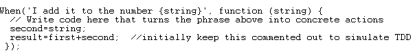

# BDD With Gherkin and CucumberJS -- Workshop

### On BDD

Behaviour Driven Development (or BDD) is a software development
methodology that fosters collaboration between technical and
nontechnical participants of the software development process. It is
known also as FDD (Feature Driven Development) and/or ATDD (Acceptance
Test Driven Development). It was introduced in 2006[^1]. The first work
was done with Cucumber written in Ruby language with a natural language
component specified as Gherkin Language[^2]. Since then the
implementations of "cucumber" methodology have proliferated in many
other languages (cucumber-js - JavaScript, cucumber-java, JBehave -
Java, cucumber-cpp -- C++, lettuce -- Python, Behat -- PHP, SpecFlow -
C#, godog -- GoLang, etc.[^3])

### On Gherkin Language

Before writing code in any of these programming languages, there is a
need to write "Features" in a .feature file in an almost natural
language that contain the description of one feature with a few
"Scenario"-s which describe various ways to use the feature.

Once you have the said feature file, you execute the cucumber tool of
the programming language you are interested in. We will use cucumber-js
for our example, but you could use BDD with cucumber in many other
languages. The output from this run will typically indicate a failure
(as it is typical in TDD) but will also guide you to implement skeletons
of the scenarios in "step" files. Upon another run with these skeleton
steps, you may get a pass of all scenarios, but then you will need to
implement the steps properly. If you are developing a web app, you may
need extra facilities to connect to the upcoming web app to assert the
proper implementation of the scenario(s). In Ruby you would use
Capybara, in JavaScript you'd use any of Selenium webDriver(s), Jasmine,
Chai, Mocha etc, in PHP you may use either Mink or phpSelenium, etc).

You can see some examples of feature files for instance in cucumber-js
repository itself:
<https://github.com/cucumber/cucumber-js/tree/main/features>

Also in the same repository, in the step_definitions subfolder, you can
see examples of , well, step definitions in javascript:
<https://github.com/cucumber/cucumber-js/tree/main/features/step_definitions>

Notice that the same steps can be used by several features, so you do
not have a one-one correspondence between features and steps.

## Example in JavaScript

### Create a folder for this example (I use D:\\dev\\cucumberjs-workshop)

### Change Directory (use the cd command) to that folder)

### Make a subfolder named "features" and go there

### Create a file named **addition.feature** with the following content

#### Afterward you should see this

### Breakdown of the feature file

The first line of the code above defines a feature. "Feature" is part of
Gherkin syntax, "Addition" is the name you have given to this feature.

The next indented lines describe the user story which you can do also
following a classic "User Story Template" that goes like:

***As a \<type of user\>, I want \<some goal\> so that \<some
reason\>.***

No need to follow thia very closely as it is not used to be executed.

Next come the definition of a Scenario. "Scenario" is a Gherkin keyword;
the indented lines usually follow the Given/When/Then syntax (these are
recognized Gherkin keywords) which can also interpreted as
"Precondition/Action/Postcondition" that we have seen when designing
Test Cases with any of the techniques.

### Let's install cucumber-js (this is independent of the previous step(s) and can be done in the beginning)

For the following you need to have Nodejs installed and available from
[www.nodejs.org](http://www.nodejs.org). Once Nodejs is installed you
have access to two commands, node and npm. You can make sure you have
those by issuing the following (otherwise, install nodejs and come back
here):

#### Check for nodejs and npm being installed

#### Go up one level to the root of our example (using "cd ..")

#### Create a npm package using "npm init -f"

#### Use npm (Node Package Manager) to install cucumberjs

You should now see a node_modules subfolder which itself has many
subfolders including a .bin subfolder with the following content:

It is this cucumber-js.cmd that we will be using in the following.

#### The package.json now looks like

Notice devDependencies key which ia a result of the "---save-dev" switch
in the previous installation command.

#### You can execute cucumber-js like so

#### Change scripts-\>test to "cucumber-js"

It would be more convenient to use the scripts-\>test setting in
package.json like so (by just editing package.json in notepad for
example):

Now we can use "npm run test" to run the script named test (which is
bound to a script in .bin folder named "cucumber-js"). If we want to
pass extra arguments to that command we use the standard way of
appending "---" and then the extra arguments. For instance to get the
version of cucumber-js we should run like this:

If you skipped the extra \--, you will get the version of npm tool, not
the cucumber-js tool:

You can shorten the command line even more by dropping "run", as it is
understood automatically by npm for all the configured scripts:

## Using Cucumber

Now that we have cucumber installed and set up, and we have at least one
a feature file, we can start using cucumber.

### Running cucumber with no arguments you see this

The report contains valuable information in several respects:

- First, you see three failures (the UUU part), all because of undefined
portions/steps.
- Second, for each undefined portion/step, you are given an explanation
(starting with '?') as well as an excerpt/snippet you can use to define
it in JavaScript (this is were the language of implementation enters the
picture -- if you were using cucumber-java, you'd get the snippets in
java).

### Under features folder create a subfolder named step_specifications and inside that create a file named steps.js

### Paste the following in the file steps.js and save

Except for the first line, that is the common way to import cucumber-js
functionality (implementation of Given, When and Then functions), the
rest is provided for you by cucumber in the form of snippets earlier.

### Run the feature again (you need to go to top first) and now you will see

(NB: The final portion with "Share cucumber..." is identical as above so
it is skipped)

So now the quick codes are P---which means "Pending, Skipped, Skipped".
We will need to implement the step skeletons now.

### Implement steps

In order to implement steps we will need to issue assertions. There are
many ways to do this, but one very useful npm package is the "chai"
package (Notice that JavaScript's name was created as a way to ride the
coattails of Java which was having a formidable advertising campaign at
the time of creation; Java as used by Sun, was supposed to be named by
the famous coffee, so Chai is a pun on that (it means Tea), as another
hot drink. These puns are ubiquitous in Node/Npm and other ecosystems,
as you will hear also tools named "Jasmine (another type of tea),
Cucumber (a green vegetable to indicate the passing of all tests),
lettuce (another type of green vegetable to indicate a passing of all
testst) etc.

### Install Chai

#### Now package.json's devDependencies looks like

...

...

### Import except function from Chai package in steps.js

### Implement a rudimentary functionality by hardcoding in steps.js

(you'd need to use a supporting World object in order to use the same
step in various scenarios):

### Run cucumber again and you'll see

This is very much TDD now; we get 2 passing steps (in green) and one
failing step (in red).

### Uncomment the line

"//result=first+second":

### Run cucumber again to see

## For more on cucumber in general and implementations in various languages see

- <https://cucumber.io/>
- <https://github.com/cucumber>

[^1]: See <https://dannorth.net/introducing-bdd/>
[^2]: Apparently Gherkin is a type of cucumber used mainly for pickling (See <https://www.merriam-webster.com/dictionary/gherkin>)
[^3]: See <https://github.com/cucumber>
